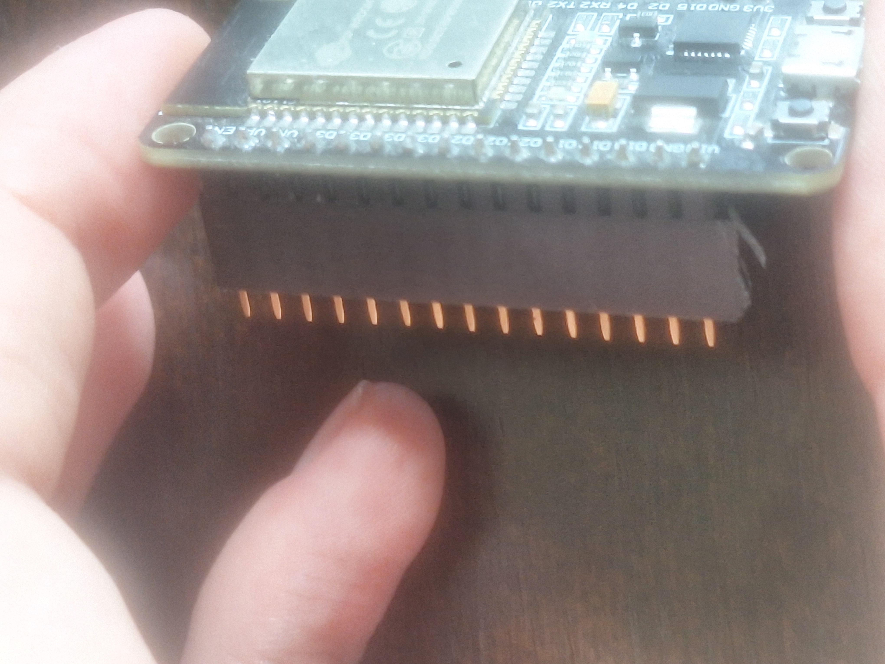
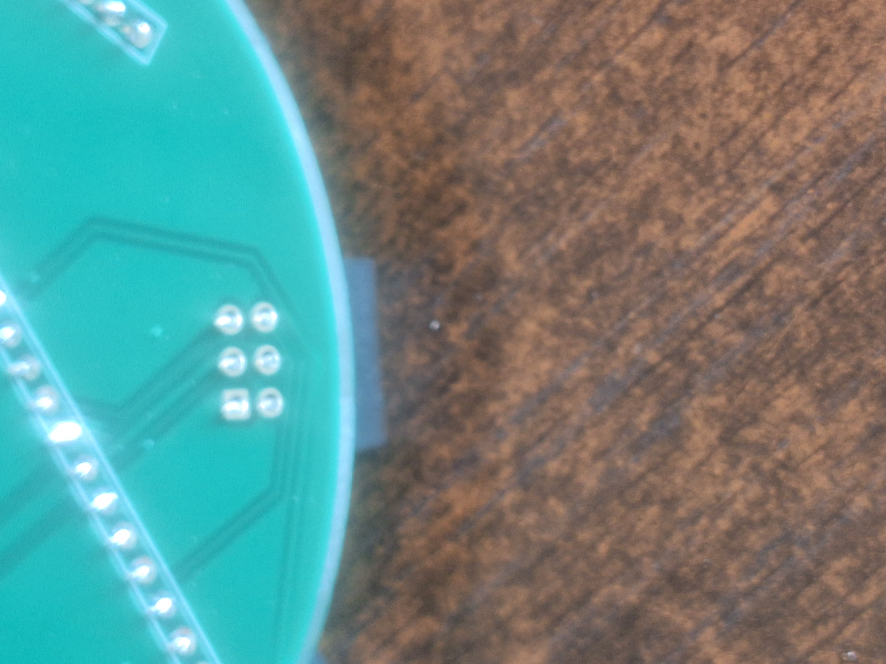
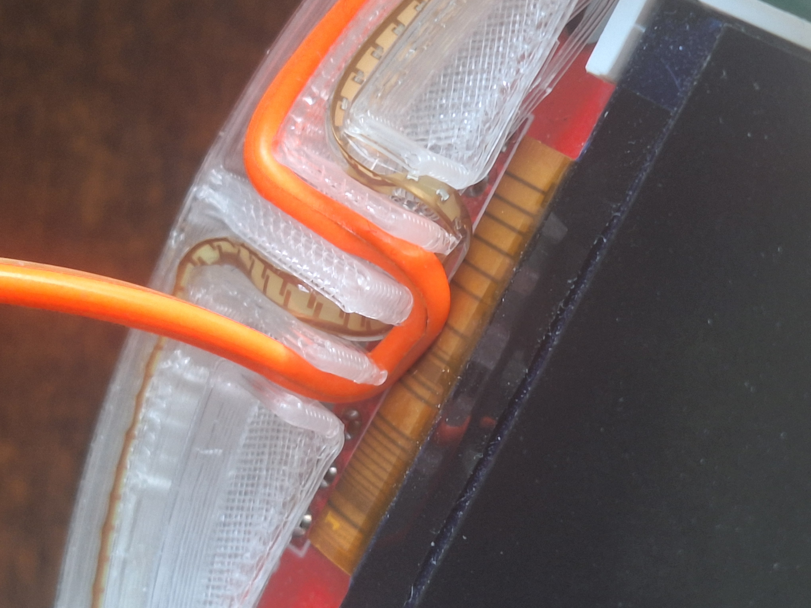
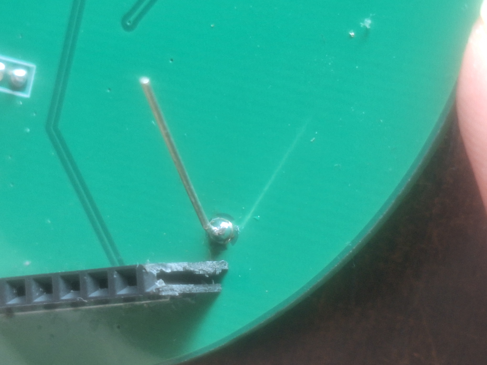

# WHY2025_badge
a badge made for why2025 for fun.This is not the official badge.

> ⚠️ **Warning:** 
> The pcb given on why2025 has a footprint mistake on the ti boost converter.
> Sorry due to time i was not able to fully check the footprint i just slaped on a 5P SOT package but the pining is incorrect.
> I did not save the corrected version so you can have a look on your own.
> 

### 🖼️ Finished

---

### 🔢 Steps picture by picture

---

### 🎨 Color Info

### If you get a pcb with the ti converter fixed

